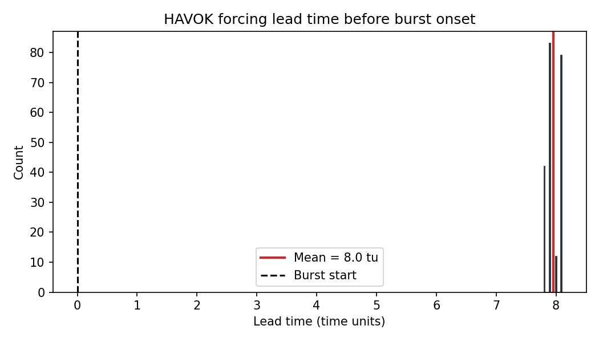
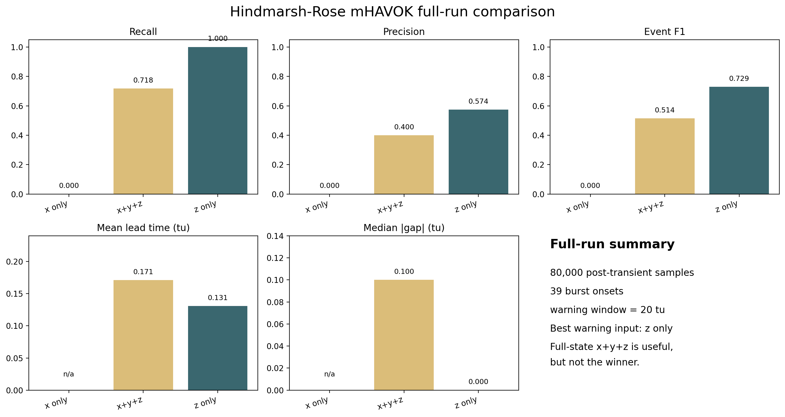

<!-- _class: lead -->

# Hindmarsh-Rose mHAVOK Final Results
## 80k-sample burst-warning sweep

### Question

- Can a multichannel HAVOK embedding produce a forcing-like signal that warns us before HR burst onset?
- Which observable set actually carries the cleanest warning information?

### Bottom line

- **Observable choice matters more than channel count.**
- On the tested grid, **z only** is the best warning model.
- The full-state **x+y+z** model is useful, but it is **not the winner**.

Post-transient samples80,000

Burst onsets39

Best warning comboz only

---

# Prediction Target

### What we want to predict

- The target is **burst onset**, not generic large-amplitude activity.
- A useful warning signal must turn on **before** the burst begins.
- Single-channel HAVOK already shows that forcing activation clusters near burst onset.
- The mHAVOK question is whether **multiple observables** sharpen that warning or reveal which variables matter most.

### Why HR is a good test

- The regime is irregular enough that burst timing is nontrivial.
- It is still structured enough that a delay-embedding approach is scientifically reasonable.

Reference HR burst-detection plot: the presentation target is the onset of each burst, and the forcing-like signal is useful only if it activates beforehand.

---

# Single-Channel HAVOK Baseline

The original HAVOK warning signal already captures every true burst across 50, 30, 20, and 10 time-unit windows.

Those activations are not just present; they arrive before onset, with a mean lead time of about 8.0 time units.

### Why this matters for the final results

- This establishes the baseline scientific fact: the forcing idea is already useful as a warning signal in HR.
- The mHAVOK sweep is therefore not asking whether warning is possible at all.
- It is asking **which observables carry that warning information most cleanly**.

---

# What mHAVOK Does

### 1. Observe channels

- Start from the measured HR coordinates: **x(t), y(t), z(t)**.
- The goal is to ask which of these channels carries burst-warning information.

### 2. Build stacked Hankel blocks

- Form one delay-embedding Hankel matrix per channel.
- Stack those blocks vertically so the SVD sees **time history across channels**.

### 3. Extract latent coordinates

- Use the SVD to find low-dimensional coordinates.
- Treat the last retained coordinate as the **forcing-like mode**.

### 4. Convert forcing into warnings

- Threshold the forcing signal.
- Merge nearby activations into one event.
- Score whether each predicted event lands inside a pre-burst warning window.

Warning window20.0 tu

Forcing quantile0.80

Merge gap30.0 tu

---

# Full Sweep Setup

### Sweep design

- Post-transient analysis window: **80,000** samples
- Detected burst onsets: **39**
- Delay grid: **50, 100, 150**
- Rank grid: **5, 7, 9, 11, 13**
- Observable sets: **x, y, z, x+y, x+z, y+z, x+y+z**

### What the sweep is testing

- Does adding channels improve burst-warning quality?
- Does the full-state model **x+y+z** beat simpler observable sets?
- Is the scientifically useful result “more channels help,” or is it “the right channel matters most”?

### Evaluation rule

- A model is good when it produces **high recall and precision** for warning events before burst onset.
- We also track lead time and alignment, but the practical question is still: **does the warning arrive early enough and selectively enough to be useful?**

---

# Main Results: Observable Choice Dominates

Exact 80k-sample final-result comparison: the full-state x+y+z model is useful, but z only is better on recall, precision, F1, and median alignment gap.

### Strongest result

- The best warning model on the tested grid is **z only**, not the full-state model.
- Its median absolute gap is effectively **0.0** time units in the completed full-run summary.

### Interpretation

- The slow adaptation variable **z** appears to carry the cleanest burst-cycle information.
- Adding every channel does **not** automatically improve warning quality.

---

<!-- _class: dark -->

# What We Can Claim Safely

### Defensible claim

- HR mHAVOK is useful as an **observable-screening tool**.
- It shows that burst-warning quality depends strongly on **which channels are included**.
- On this grid, **z** and not **x+y+z** is the best warning input.

### Important limit

- Do **not** oversell this as “mHAVOK beats HAVOK everywhere.”
- The strongest direct warning result in the repo is still the original single-channel HAVOK story.
- The multichannel result is valuable because it clarifies **which observables carry warning information**.

Best z-only F10.729

Best x+y+z F10.514

Best x-only F10.000

---

# Presentation Takeaways

### How to present this

- Lead with the **prediction problem**: warn before burst onset.
- Spend time explaining what the forcing-like coordinate means.
- Show one onset plot and two summary graphs; keep the dense sweep behind GitHub or a QR code.

### Scientific takeaway

- The useful HR mHAVOK result is **not** “more channels are better.”
- The useful result is that **channel choice is a first-order modeling decision**.
- For the tested 80k-sample sweep, the cleanest warning signal comes from **z**.

### One-sentence conclusion

- In Hindmarsh-Rose, the forcing-based warning idea remains strong, and the new mHAVOK sweep shows that **the slow adaptation variable is the most informative warning observable on the tested grid**.

