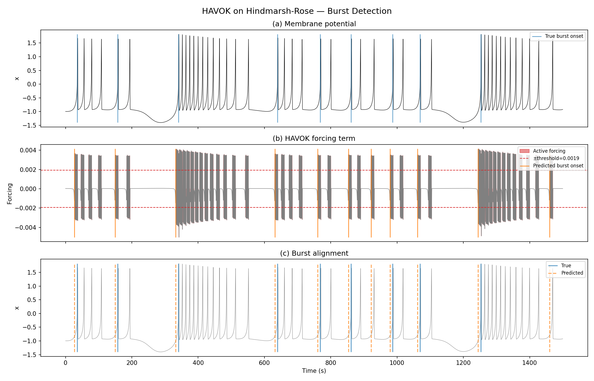
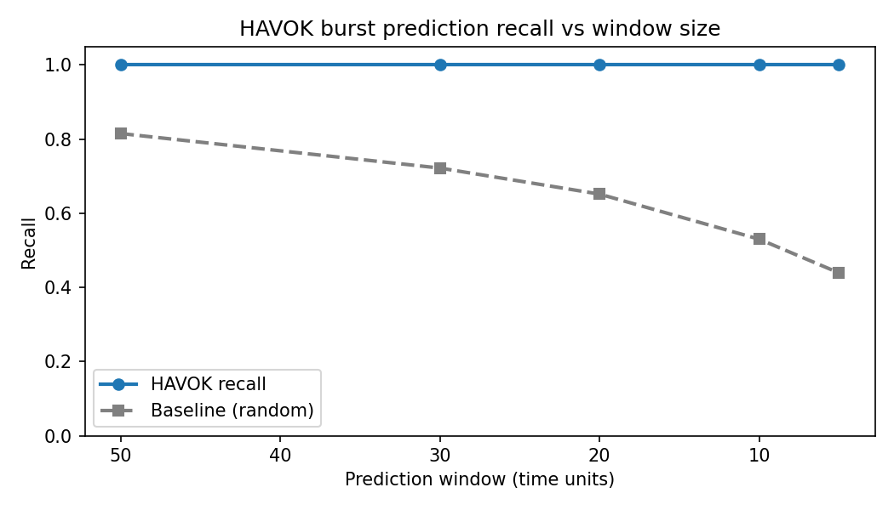
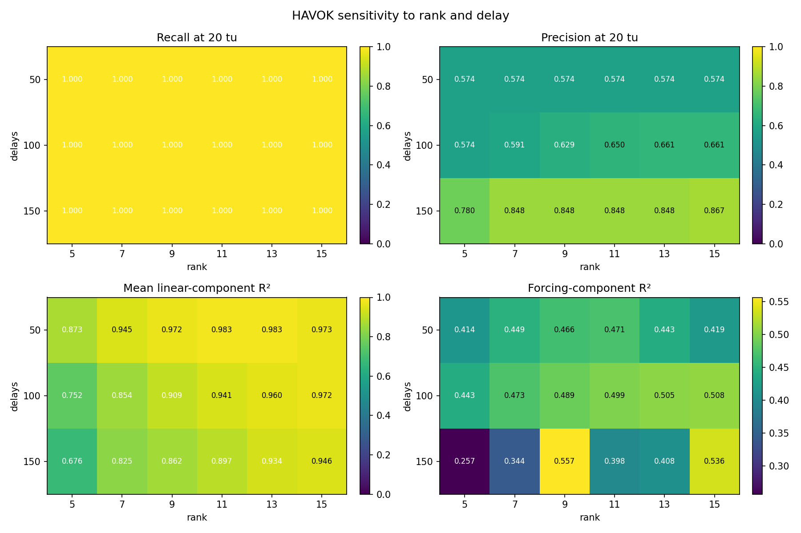

<!-- _class: lead -->

# HAVOK Burst Warning and mHAVOK Model Selection
## Final project results for Hindmarsh-Rose and Lorenz

### Hindmarsh-Rose

- Question: does the HAVOK forcing signal switch on before burst onset?
- Result: **yes for onset warning**, with strong recall across practical lead windows.

### Lorenz

- Question: how sensitive is mHAVOK model ranking to rank, delays, and observable choice?
- Result: **very sensitive**. The winner changes with the objective and channel set.

HR bursts216

Best HR recall @ 20 tu1.000

Best Lorenz combox+y+z

---

# Hindmarsh-Rose Bursting Regime

### Setup summary

- Total simulated time: **49049.9** time units
- Bursts detected: **216**
- Mean inter-burst interval: **227.8**
- IBI standard deviation: **81.4**
- Coefficient of variation: **0.36**

### Why this matters

- The target is **burst onset**, not generic large amplitude activity.
- The regime is structured enough for delay embedding, but irregular enough to make onset timing nontrivial.

Burst detection trace from the HR simulation.

---

# HR Forcing Works as an Early-Warning Signal

Recall remains perfect across 50, 30, 20, and 10 time-unit windows.

### Core result

- Forcing threshold: **0.001931**
- Active fraction: **0.203**
- Predicted burst onsets: **309**
- Mean lead time: **8.0** time units

### Interpretation

- Every true burst is preceded by forcing activation over practical lead windows.
- Precision is **0.699** at 50, 30, 20, and 10 time units, so the signal is selective enough to be useful even though it is not perfectly sparse.
- The 5-time-unit precision collapse is a timing-resolution issue near onset, not a total failure of the forcing signal.

---

# HR Sensitivity to Rank, Delays, and Channel

Best x-channel setting on the tested grid: <code>delays = 150</code>, <code>rank = 15</code>.

### Best tested settings

| Channel | Delays | Rank | Recall | Precision | F1 | Mean linear R^2 |
| --- | ---: | ---: | ---: | ---: | ---: | ---: |
| x | 150 | 15 | 1.000 | 0.867 | 0.929 | 0.946 |
| y | 150 | 15 | 1.000 | 0.867 | 0.929 | 0.938 |
| z | 150 | 15 | 1.000 | 0.848 | 0.918 | 0.972 |

### Takeaway

- The warning result is not coming from one fragile setting.
- **x and y** are best for event detection on the tested grid.
- **z** gives the strongest linear-state fit, but slightly weaker event precision.

---

<!-- _class: dark -->

# HR Caveat: Warning Success Is Not Full-State Success

### Strong warning result

- Recall at 20 time units: **1.000**
- Precision at 20 time units: **0.699**
- Lead time: **8.0** time units on average

### Weak generative result

- Forcing-mode R^2: **0.5128**
- Train reconstruction R^2_rec: **-1935.3039**
- Test reconstruction R^2_rec: **-518.8316**

### Statistical mismatch in free-running behavior

- True IBI mean: **227.8**
- Predicted IBI mean: **159.0**
- KS statistic: **0.3191**, p-value **0.0000**
- True exceedances above 1.5: **6360**
- Reconstructed exceedances above 1.5: **145401**

### Claim we can defend

- HAVOK is useful here as an **event-warning detector**.
- It is **not yet** a reliable free-running surrogate for burst statistics or tail-risk claims.

---

# Lorenz: The Best Model Depends on the Objective

### Default <code>x+z</code> setup on the tested rank-delay grid

| Objective | Delays | Rank | Median abs gap (s) | Recall | Precision | F1 | Mean linear R^2 |
| --- | ---: | ---: | ---: | ---: | ---: | ---: | ---: |
| Best event F1 | 150 | 11 | 0.0480 | 0.6429 | 0.2535 | 0.3636 | 0.9382 |
| Best alignment | 150 | 13 | 0.0275 | 0.6071 | 0.2208 | 0.3238 | 0.9493 |

### What changed

- The notebook sweep sorts alignment and event metrics separately.
- Those two objectives **do not pick the same model**.

### Presentation consequence

- The baseline-versus-tuned overlay in the notebook is showing the **best alignment** model.
- It should not be described as the **best event-detection** model.

---

# Lorenz Observable Choice Changes the Ranking

| Channel combo | Delays | Rank | Recall | Precision | Accuracy | F1 | Mean linear R^2 | Chamfer (s) |
| --- | ---: | ---: | ---: | ---: | ---: | ---: | ---: | ---: |
| x+y+z | 150 | 5 | 0.7143 | 0.4878 | 0.8924 | 0.5797 | 0.7450 | 0.1488 |
| x+y | 150 | 5 | 0.6429 | 0.3273 | 0.8794 | 0.4337 | 0.9988 | 0.2095 |
| x | 150 | 5 | 0.6429 | 0.3214 | 0.8792 | 0.4286 | 0.9995 | 0.1937 |
| x+z | 150 | 11 | 0.6429 | 0.2535 | 0.8801 | 0.3636 | 0.9382 | 0.2352 |

### Main result

- The best event-detection model on the tested grid is **x+y+z**, not the earlier x-only or x+z variants.

### Why this matters

- Adding <code>y</code> changes the ranking materially.
- The strongest event model does **not** maximize mean linear R^2.

---

# Lorenz Diagnostics: Most Modes Fit Well, the Last One Does Not

### Tuned component fit summary

| Component block | R^2 |
| --- | ---: |
| v1 through v7 | 1.0000 |
| v8 | 0.9991 |
| v9 | 0.9989 |
| v10 | 0.9992 |
| v11 | 0.9986 |
| v12 | 0.3957 |

### Interpretation

- The linear latent structure is fit extremely well for most modes.
- The last forcing-like coordinate is the bottleneck.
- That is why model ranking changes once the evaluation target shifts from fit quality to event detection.

### Related Lorenz objective table

| Observable set | Tight alignment | Balanced | Early warning |
| --- | --- | --- | --- |
| z only | winner |  |  |
| x and z |  | winner |  |
| x only |  |  | winner |

This earlier objective-selection table and the full combo benchmark tell the same story: **the winner depends on the objective**.

---

<!-- _class: dark -->

# Final Takeaways

### Hindmarsh-Rose

- HAVOK forcing is a **strong early-warning signal** for burst onset.
- The result is robust across the tested windows and across multiple input channels.
- The current model should **not** yet be presented as a high-fidelity free-running burst surrogate.

### Lorenz

- In mHAVOK, **rank, delay, objective, and observable choice all matter**.
- The best alignment model, best event-F1 model, and best full observable set are different.
- The practical lesson is to choose the model **based on the question you want to answer**.

HR best tested precision0.867

Lorenz best combo F10.580

Most honest summarywarning yes, surrogate not yet

