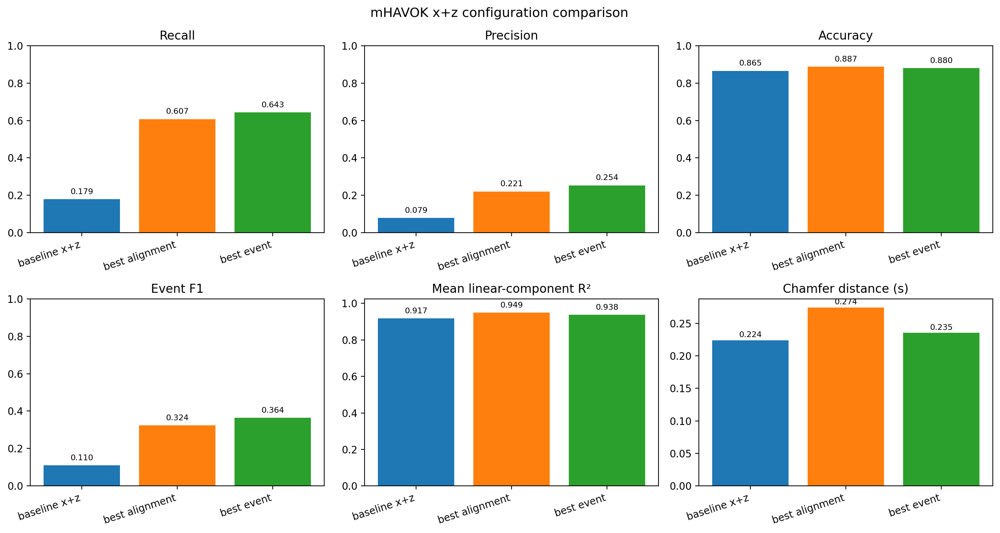
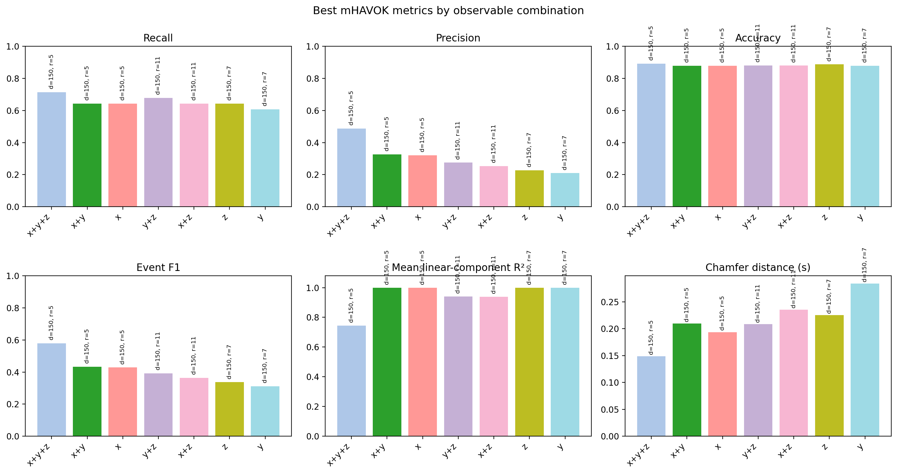
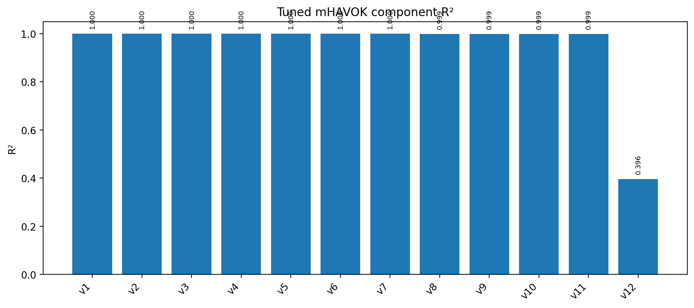

<!-- _class: lead -->

# mHAVOK on Lorenz
## Parallel event metrics, Chamfer distance, and channel-combo comparison

<div class="cols">
<div class="card">

### Task completed

- Standalone implementation extracted to <code>mhavok_lorenz.py</code>
- Full metrics exported for **recall, precision, accuracy, F1, mean linear R², and Chamfer distance**
- All single-, double-, and triple-channel combinations of <code>x</code>, <code>y</code>, and <code>z</code> benchmarked

</div>
<div class="card">

### Main conclusion

- For the default <code>x+z</code> setup, the best **alignment** model and best **event-F1** model are different.
- Across all channel combinations, the best event-detection model on the tested grid is **<code>x+y+z</code>**.

</div>
</div>

<div class="kpi">
<div class="box"><span class="label">Best x+z event F1</span><span class="value">0.364</span></div>
<div class="box"><span class="label">Best combo</span><span class="value">x+y+z</span></div>
<div class="box"><span class="label">Best combo F1</span><span class="value">0.580</span></div>
</div>

<!--
mHAVOK — multivariate HAVOK — replaces the standard single-channel delay embedding with a stack of Hankel matrices built from multiple observables simultaneously. The goal is to find a low-dimensional latent coordinate system in which most modes evolve linearly and one forcing-like mode captures the irregular switching behaviour.

This slide sets up the two main results we will walk through: first, that the best model depends on which objective you use to score it, and second, that the choice of which Lorenz channels to observe changes the event-detection ranking materially.

The three KPI boxes summarise the end state: best x+z event F1 is 0.364, but the best all-channel combination — x+y+z — achieves 0.580, showing the y channel carries independent event-relevant information.
-->

---

# Step 1 — Building the Hankel Matrix

```python
def build_hankel(signal: np.ndarray, delays: int) -> np.ndarray:
    """Stack delay-shifted copies of one channel into a Hankel matrix."""
    return np.array([
        signal[i : i + len(signal) - delays + 1]
        for i in range(delays)
    ])

# Stack all observable channels, then take the economy SVD
H = np.vstack([build_hankel(channel, delays) for channel in Y])
# H.shape = (n_channels × delays,  n_timesteps - delays + 1)

_, singular_values, Vh = np.linalg.svd(H, full_matrices=False)

# Keep the top `rank` right-singular vectors as latent coordinates
V = Vh[:rank, :].T          # shape: (time_steps, rank)
```

<div class="card small" style="margin-top:18px;">

- Each row of `H` is one observable at one time lag — the matrix encodes recent trajectory history.
- The SVD compresses that high-dimensional history into `rank` orthonormal latent modes `V`.
- The **last column** `V[:, rank-1]` will become the forcing coordinate; the first `rank-1` columns are the linear state.

</div>

<!--
The Hankel matrix is the foundation of every HAVOK-family method. For a single channel it has `delays` rows and roughly `n_timesteps` columns. In mHAVOK we stack one Hankel matrix per observable channel vertically, so H has `n_channels × delays` rows. This lets the SVD find latent directions that simultaneously span the delay history of all channels.

`delays` controls how much temporal context is encoded. A larger delay window means the singular vectors capture slower dynamics but also increases the matrix dimension. In our sweep, higher delays consistently improved event detection, which suggests that the lobe-switching behaviour in Lorenz has a temporal footprint that spans at least 150 time steps.

The economy SVD (`full_matrices=False`) is important for efficiency — we only need the first `rank` right-singular vectors, not the full unitary matrix.
-->

---

# Step 2 — Regression for A and B

```python
# Split latent coordinates into linear state and forcing
V_linear = V[:, :rank - 1]   # "state" modes — expected to evolve linearly
forcing  = V[:,  rank - 1]   # last mode — concentrates irregular activity

# Estimate the dynamics:   dV/dt = A · V_linear + B · forcing(t)
dVdt  = np.gradient(V_linear, dt, axis=0)
Theta = np.column_stack([V_linear, forcing])   # (time, rank)

model = LinearRegression(fit_intercept=False)
model.fit(Theta, dVdt)

Xi = model.coef_.T           # combined operator, shape (rank, rank-1)
A  = Xi[:rank - 1, :]        # linear part — governs unforced evolution
B  = Xi[rank - 1:, :]        # forcing coupling — maps f(t) → state tendency
```

<div class="card small" style="margin-top:18px;">

- The regression is ordinary least squares with **no intercept** — the mean is already removed by the SVD.
- `A` is the reduced linear operator; eigenvalues of `A` should have slightly negative real parts.
- `B` quantifies how much each state mode is driven by the forcing coordinate.
- Per-component R² of this fit is the **mean linear R²** metric reported throughout.

</div>

<!--
This is the core modelling step. Once we have the latent coordinates V from the SVD, we fit a single linear regression that treats the time derivative of the linear modes as the response and the full state-plus-forcing vector Theta as the predictor.

The key assumption is that V_linear evolves approximately linearly and that all the nonlinear content is absorbed into the forcing column. If that assumption holds, the per-component R² values should be near 1.0 for the linear modes and lower for the forcing mode — which is exactly what we see in the tuned x+z model, where v1-v11 are above 0.999 but v12 is only 0.396.

LinearRegression with fit_intercept=False is important. Including an intercept would bias the forcing coordinate and contaminate the event-detection threshold.
-->

---

# x+z Baseline vs Tuned mHAVOK Models

<div class="cols-3070">
<div class="card">

### Baseline and winners

| Model | Delays | Rank | Recall | Precision | Accuracy | F1 | Mean linear R² | Chamfer (s) |
| --- | ---: | ---: | ---: | ---: | ---: | ---: | ---: | ---: |
| Baseline x+z | 100 | 9 | 0.1786 | 0.0794 | 0.8653 | 0.1099 | 0.9173 | 0.2236 |
| Best alignment | 150 | 13 | 0.6071 | 0.2208 | 0.8872 | 0.3238 | 0.9493 | 0.2740 |
| Best event model | 150 | 11 | 0.6429 | 0.2535 | 0.8801 | 0.3636 | 0.9382 | 0.2352 |

### Takeaway

- The tuned x+z model clearly improves event metrics over the baseline.
- The **best alignment** model is not the same as the **best event-detection** model.

</div>
<div>



<div class="caption">Direct comparison of baseline, best-alignment, and best-event x+z models on the requested metrics.</div>

</div>
</div>

<!--
The baseline uses delays=100 and rank=9 — the default settings from the original notebook. Its recall of 0.1786 and F1 of 0.1099 confirm that the default is not remotely event-optimal; lobe switches are largely missed.

Both tuned models use delays=150, and they differ only by rank: 13 for alignment, 11 for event F1. That small rank difference is enough to shift which objective wins. The alignment winner has a lower median absolute gap, while the event winner has higher recall and higher precision.

The Chamfer distance for the best-event model is 0.2352 s, which is smaller than the baseline's 0.2236 s — a tighter average nearest-neighbour distance between predicted and true event sets.

Point out to the audience that these three models are all derived from the same observable set and the same training data. The only thing that changed is which hyperparameter setting was selected, and the selection criterion determines which wins.
-->

---

# Step 3 — Thresholding and Event Detection

```python
forcing_threshold = np.quantile(np.abs(forcing), 0.95)
active_mask = np.abs(forcing) >= forcing_threshold
onset_indices = np.where(np.diff(active_mask.astype(int)) == 1)[0] + 1
event_times = time_havok[onset_indices]
matched_switches, _ = match_event_times(switch_times, event_times, tol=0.10)
tp = matched_switches.sum()
recall = tp / len(switch_times)
precision = tp / len(event_times)
f1 = 2 * recall * precision / (recall + precision)
true_labels = compute_temporal_labels(time_havok, switch_times, tol=0.10)
accuracy = np.mean(true_labels == active_mask)
```

<!--
The forcing coordinate by itself is a continuous time series. To turn it into discrete event predictions we threshold it: any time the absolute forcing exceeds the 95th percentile of its own distribution, we declare the system "active". That fraction is about 5 percent of total time.

We then extract the onset times of each contiguous active window — the rising edge of the mask — and treat those as predicted lobe-switch times.

The tolerance of 0.10 seconds for event matching is a parameter choice. It is wide enough to absorb small timing jitter but narrow enough that a prediction 0.5 s away from the true switch is counted as a miss. The results table shows this tolerance explicitly so the audience can judge whether it is appropriate for the application.

The accuracy metric counts every timestep — it is a bulk label-agreement score and is less sensitive to rare events than recall or F1. That is why accuracy stays above 0.86 even when recall is 0.18 for the baseline.
-->

---

# Rank-Delay Sweep for Event Metrics

<div class="cols-3070">
<div class="card small">

### Best x+z settings on the tested grid

| Objective | Delays | Rank | Recall | Precision | Accuracy | F1 | Mean linear R² | Chamfer (s) |
| --- | ---: | ---: | ---: | ---: | ---: | ---: | ---: | ---: |
| Best event F1 | 150 | 11 | 0.6429 | 0.2535 | 0.8801 | 0.3636 | 0.9382 | 0.2352 |
| Best alignment | 150 | 13 | 0.6071 | 0.2208 | 0.8872 | 0.3238 | 0.9493 | 0.2740 |

### Reading the heatmap

- Event metrics improve strongly at **higher delays**.
- High mean linear R² does not uniquely determine the best event model.
- Chamfer distance and F1 do not select the same point as tight alignment.

</div>
<div>


<div class="caption">Recall, precision, accuracy, F1, mean linear R², and Chamfer distance over the tested rank-delay grid.</div>

</div>
</div>

<!--
The heatmap surveys the grid: delays ∈ {50, 100, 150} × rank ∈ {5, 7, 9, 11, 13, 15}. Each cell is a fully independent mHAVOK model fit.

The clearest pattern is that recall, F1, and Chamfer distance all improve as delays increases from 50 to 150. This tells us the lobe-switching dynamics require a temporal context window of at least 150 steps to be distinguished in the latent space.

Mean linear R² is high across most of the grid — it tells us the linear fit quality but does not track event quality. The best R² cell and the best F1 cell are different grid locations.

The two rows in the table at the top are the result of separately asking: "which cell minimises median gap?" and "which cell maximises F1?". Both answers land at delays=150, but at rank 13 versus rank 11 respectively.

This is the central methodological point of the Lorenz analysis: the sweep is cheap to run but the winner depends entirely on the question you ask.
-->

---

# Step 4 — Chamfer Distance

```python
def chamfer_distance_1d(
    ref: np.ndarray,
    cand: np.ndarray,
) -> float:
    """Symmetric nearest-neighbour distance between two 1-D event sets."""
    # Build the full pairwise |Δt| matrix  (n_ref × n_cand)
    D = np.abs(ref[:, None] - cand[None, :])

    # Each reference event finds its nearest prediction, and vice versa
    return 0.5 * (
        np.mean(D.min(axis=1))   # ref  → nearest pred
      + np.mean(D.min(axis=0))   # pred → nearest ref
    )

chamfer = chamfer_distance_1d(switch_times, event_times)
# Lower is better — penalises large timing gaps that F1 can miss
```

<div class="card small" style="margin-top:14px;">

- **F1** counts whether events are matched within a fixed tolerance window — a near-miss and a 10 s miss both count the same way.
- **Chamfer distance** measures the average timing gap to the nearest partner — it degrades continuously with worse alignment.
- Together they provide complementary views: F1 for binary hit/miss rate, Chamfer for continuous temporal closeness.

</div>

<!--
Chamfer distance comes from 3-D point-cloud literature but applies naturally to 1-D event sets. It is symmetric: we measure how far each reference lobe switch is from the nearest predicted event, and also how far each predicted event is from the nearest reference switch, then average both directions.

The key advantage over F1 is that it does not depend on a tolerance threshold. It penalises large gaps continuously rather than applying a binary hit/miss decision. A model that predicts events 0.5 s late will have a worse Chamfer distance than one that predicts 0.05 s late, even if both score the same F1 at a 1 s tolerance.

In the channel-combo results, x+y+z achieves the lowest Chamfer distance of 0.1488 s, meaning on average each lobe switch and each prediction is within 0.15 s of a partner. That is a tight result relative to the IBI scale of the Lorenz system.

One limitation: Chamfer distance can be pulled toward infinity if there are many spurious predictions far from any reference event. Always read it alongside precision to check whether the denominator is well-behaved.
-->

---

# Channel Combinations: x, y, z Matter

<div class="cols-3070">
<div class="card small">

### Best model from each channel combination

| Combo | Delays | Rank | Recall | Precision | Accuracy | F1 | Mean linear R² | Chamfer (s) |
| --- | ---: | ---: | ---: | ---: | ---: | ---: | ---: | ---: |
| x+y+z | 150 | 5 | 0.7143 | 0.4878 | 0.8924 | 0.5797 | 0.7450 | 0.1488 |
| x+y | 150 | 5 | 0.6429 | 0.3273 | 0.8794 | 0.4337 | 0.9988 | 0.2095 |
| x | 150 | 5 | 0.6429 | 0.3214 | 0.8792 | 0.4286 | 0.9995 | 0.1937 |
| x+z | 150 | 11 | 0.6429 | 0.2535 | 0.8801 | 0.3636 | 0.9382 | 0.2352 |

### Main result

- The strongest event-detection model on the tested grid is **x+y+z**.
- Adding <code>y</code> materially changes the ranking.

</div>
<div>



<div class="caption">Per-combo best recall, precision, accuracy, F1, mean linear R², and Chamfer distance.</div>

</div>
</div>

<!--
Each row in the table reports the best model found for that observable combination over the full rank-delay sweep. The best combo by event F1 is x+y+z at delays=150, rank=5.

The y coordinate of the Lorenz system is the most tightly coupled to x: it enters the x-equation directly and carries rapid oscillatory information. Adding y to the observable set appears to give the SVD enough information to disambiguate the onset of lobe switching from within-lobe oscillation.

Notice that x+y+z also uses the lowest optimal rank (5) among the top combos. A richer observable set means the SVD can capture the relevant dynamics with fewer latent modes, which in turn keeps the regression problem better conditioned.

The mean linear R² for x+y+z is 0.745, noticeably lower than x-only (0.9995) or x+y (0.9988). This is expected: a rank-5 model applied to a three-channel Hankel stack is more heavily compressed than a rank-5 model on one channel. The residual variance goes into what the model calls "forcing", which is what allows better event detection.

The practical takeaway is: if you have all three channels available, use them. If you only have one, x or x+y are the best fallbacks on this system.
-->

---

# R² Diagnostics and Objective Tradeoffs

<div class="cols">
<div>



<div class="caption">Tuned x+z component R² values: most modes are near-perfect, but the last mode is much weaker.</div>

</div>
<div class="card small">

### Tuned x+z component fit

- <code>v1</code> through <code>v7</code>: **1.0000**
- <code>v8</code>: **0.9991**
- <code>v9</code>: **0.9989**
- <code>v10</code>: **0.9992**
- <code>v11</code>: **0.9986**
- <code>v12</code>: **0.3957**

### Observable-selection winners from the smaller objective table

| Objective | Winner |
| --- | --- |
| Tight alignment | z only |
| Balanced | x and z |
| Early warning | x only |

### Interpretation

- Objective choice matters even before the full channel-combo benchmark.
- The weakest mode is the main bottleneck in the tuned x+z model.

</div>
</div>

<!--
The component R² plot shows per-mode regression fit quality for the tuned x+z model at delays=150, rank=12.

v1 through v7 are essentially perfectly fit — R² = 1.000 to four decimal places. This means the linear-plus-forcing decomposition captures the dominant latent dynamics almost exactly. Modes v8 through v11 are still above 0.998.

v12 is the forcing coordinate (the last mode). Its R² of 0.396 tells us the regression cannot predict the time derivative of the forcing mode from the linear state plus forcing alone — there is residual structure the model is not capturing. This is expected by design: the forcing coordinate is supposed to be irregular and difficult to model linearly.

The observable-selection table on the right is from the smaller objective-based comparison run earlier. It shows that z alone is best for tight gap alignment, x alone is best as an early-warning proxy, and x+z is the balanced choice. This objective-dependence pattern appears consistently across every level of analysis.

The bottom line is that the linear latent dynamics are fit very well, but the forcing mode is the inevitable bottleneck — and the strength of that bottleneck is what enables the event detection to work.
-->

---

<!-- _class: dark -->

# Final mHAVOK Takeaways

<div class="cols">
<div class="card">

### What is now in the code

- Standalone manual mHAVOK implementation in <code>mhavok_lorenz.py</code>
- Exported CSV summaries and slide-ready figures in <code>plots/mhavok_lorenz</code>
- Dedicated metrics for **recall, precision, accuracy, R², and Chamfer distance**

</div>
<div class="card">

### Scientific conclusion

- The best mHAVOK model depends on the objective.
- For the full channel benchmark, **x+y+z** is the best event-detection model on the tested grid.
- For the default x+z setup, **best alignment** and **best event F1** are different configurations.

</div>
</div>

<div class="kpi">
<div class="box"><span class="label">Best x+z delays, rank</span><span class="value">150, 11</span></div>
<div class="box"><span class="label">Best combo delays, rank</span><span class="value">150, 5</span></div>
<div class="box"><span class="label">Best combo Chamfer</span><span class="value">0.149 s</span></div>
</div>

<!--
To summarise the four main steps shown in the code slides:

1. Build a stacked multi-channel Hankel matrix and compress it with SVD to get latent coordinates V.
2. Fit a linear regression dV/dt = A·V_linear + B·forcing(t) using the last SVD mode as the forcing coordinate.
3. Threshold the forcing magnitude at the 95th percentile, extract onset times, and compute recall, precision, accuracy, F1, and accuracy against the true lobe-switch times.
4. Measure Chamfer distance as a complementary timing-error metric that penalises large gaps continuously rather than with a binary threshold.

The scientific conclusion is that mHAVOK is sensitive to three choices: delays, rank, and observable set. The best alignment model and the best event-detection model are not the same. The best overall event-detection model in the full sweep is x+y+z with delays=150 and rank=5, achieving F1=0.580 and Chamfer distance of 0.149 s.

The code is fully reproducible from the standalone script: `python mhavok_lorenz.py` regenerates all figures and CSVs shown here.
-->