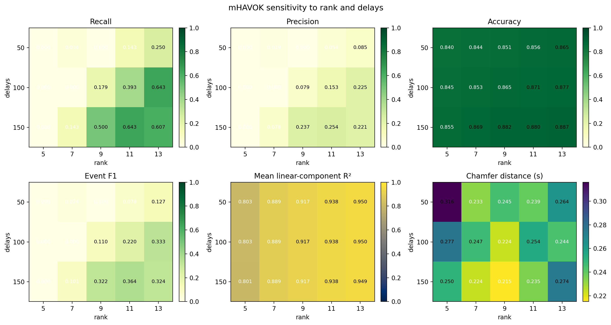

<!-- _class: lead -->

# mHAVOK on Lorenz
## Parallel event metrics, Chamfer distance, and channel-combo comparison

### Task completed

- Standalone implementation extracted to <code>mhavok_lorenz.py</code>
- Full metrics exported for **recall, precision, accuracy, F1, mean linear R², and Chamfer distance**
- All single-, double-, and triple-channel combinations of <code>x</code>, <code>y</code>, and <code>z</code> benchmarked

### Main conclusion

- For the default <code>x+z</code> setup, the best **alignment** model and best **event-F1** model are different.
- Across all channel combinations, the best event-detection model on the tested grid is **<code>x+y+z</code>**.

Best x+z event F10.364

Best combox+y+z

Best combo F10.580

---

# x+z Baseline vs Tuned mHAVOK Models

### Baseline and winners

| Model | Delays | Rank | Recall | Precision | Accuracy | F1 | Mean linear R² | Chamfer (s) |
| --- | ---: | ---: | ---: | ---: | ---: | ---: | ---: | ---: |
| Baseline x+z | 100 | 9 | 0.1786 | 0.0794 | 0.8653 | 0.1099 | 0.9173 | 0.2236 |
| Best alignment | 150 | 13 | 0.6071 | 0.2208 | 0.8872 | 0.3238 | 0.9493 | 0.2740 |
| Best event model | 150 | 11 | 0.6429 | 0.2535 | 0.8801 | 0.3636 | 0.9382 | 0.2352 |

### Takeaway

- The tuned x+z model clearly improves event metrics over the baseline.
- The **best alignment** model is not the same as the **best event-detection** model.

Direct comparison of baseline, best-alignment, and best-event x+z models on the requested metrics.

---

# Rank-Delay Sweep for Event Metrics

### Best x+z settings on the tested grid

| Objective | Delays | Rank | Recall | Precision | Accuracy | F1 | Mean linear R² | Chamfer (s) |
| --- | ---: | ---: | ---: | ---: | ---: | ---: | ---: | ---: |
| Best event F1 | 150 | 11 | 0.6429 | 0.2535 | 0.8801 | 0.3636 | 0.9382 | 0.2352 |
| Best alignment | 150 | 13 | 0.6071 | 0.2208 | 0.8872 | 0.3238 | 0.9493 | 0.2740 |

### Reading the heatmap

- Event metrics improve strongly at **higher delays**.
- High mean linear R² does not uniquely determine the best event model.
- Chamfer distance and F1 do not select the same point as tight alignment.

Recall, precision, accuracy, F1, mean linear R², and Chamfer distance over the tested rank-delay grid.

---

# Channel Combinations: x, y, z Matter

### Best model from each channel combination

| Combo | Delays | Rank | Recall | Precision | Accuracy | F1 | Mean linear R² | Chamfer (s) |
| --- | ---: | ---: | ---: | ---: | ---: | ---: | ---: | ---: |
| x+y+z | 150 | 5 | 0.7143 | 0.4878 | 0.8924 | 0.5797 | 0.7450 | 0.1488 |
| x+y | 150 | 5 | 0.6429 | 0.3273 | 0.8794 | 0.4337 | 0.9988 | 0.2095 |
| x | 150 | 5 | 0.6429 | 0.3214 | 0.8792 | 0.4286 | 0.9995 | 0.1937 |
| x+z | 150 | 11 | 0.6429 | 0.2535 | 0.8801 | 0.3636 | 0.9382 | 0.2352 |

### Main result

- The strongest event-detection model on the tested grid is **x+y+z**.
- Adding <code>y</code> materially changes the ranking.

Per-combo best recall, precision, accuracy, F1, mean linear R², and Chamfer distance.

---

# R² Diagnostics and Objective Tradeoffs

Tuned x+z component R² values: most modes are near-perfect, but the last mode is much weaker.

### Tuned x+z component fit

- <code>v1</code> through <code>v7</code>: **1.0000**
- <code>v8</code>: **0.9991**
- <code>v9</code>: **0.9989**
- <code>v10</code>: **0.9992**
- <code>v11</code>: **0.9986**
- <code>v12</code>: **0.3957**

### Observable-selection winners from the smaller objective table

| Objective | Winner |
| --- | --- |
| Tight alignment | z only |
| Balanced | x and z |
| Early warning | x only |

### Interpretation

- Objective choice matters even before the full channel-combo benchmark.
- The weakest mode is the main bottleneck in the tuned x+z model.

---

<!-- _class: dark -->

# Final mHAVOK Takeaways

### What is now in the code

- Standalone manual mHAVOK implementation in <code>mhavok_lorenz.py</code>
- Exported CSV summaries and slide-ready figures in <code>plots/mhavok_lorenz</code>
- Dedicated metrics for **recall, precision, accuracy, R², and Chamfer distance**

### Scientific conclusion

- The best mHAVOK model depends on the objective.
- For the full channel benchmark, **x+y+z** is the best event-detection model on the tested grid.
- For the default x+z setup, **best alignment** and **best event F1** are different configurations.

Best x+z delays, rank150, 11

Best combo delays, rank150, 5

Best combo Chamfer0.149 s

