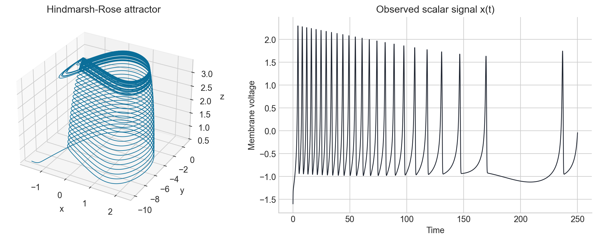
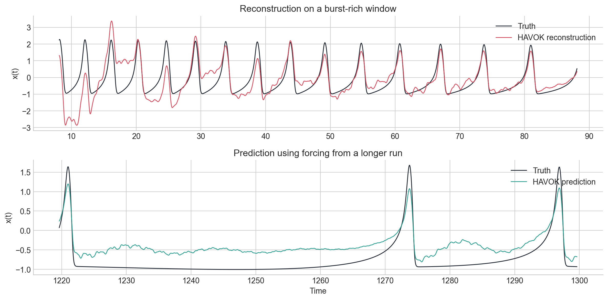
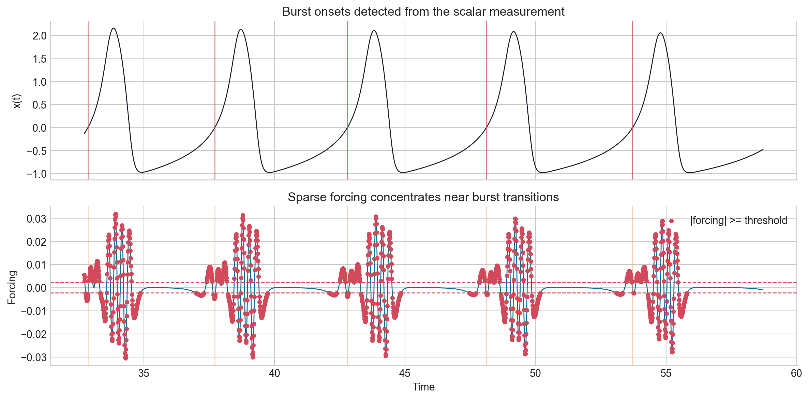
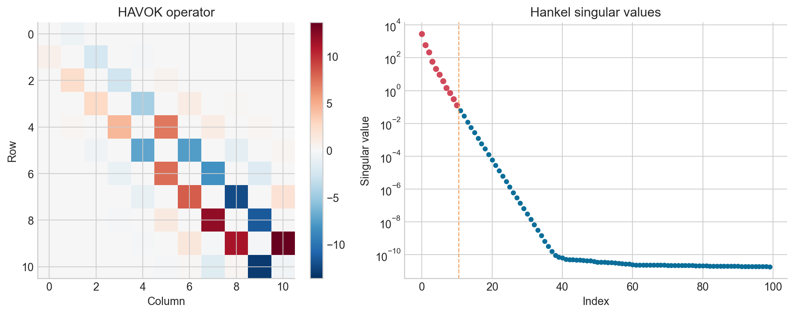

<!-- _class: lead -->

# Preliminary HAVOK Results
## Hindmarsh-Rose bursting dynamics from scalar observations

AM170B final project snapshot centered on the question: can HAVOK forcing predict burst onset in the Hindmarsh-Rose model?

Rank = 11
Delays = 100
100,000 training samples

---

# Setup And Framing

- The project replaces the Lorenz tutorial example with the Hindmarsh-Rose neuron model in a chaotic bursting regime.
- Only the scalar voltage-like variable $x(t)$ is supplied to HAVOK; the hidden goal is to recover useful low-dimensional dynamics from delayed coordinates.
- Current script settings use $\Delta t = 0.01$, rank 11, and 100 delay coordinates.
- The extended prediction section now runs after keeping the long forcing model on the same delay setting as the fitted predictor.

The full Hindmarsh-Rose attractor is generated for reference, but HAVOK is trained only on the scalar trace on the right.

---

# Result 1: Reconstruction Is Stronger Than Forecasting

- Reconstruction of the observed training signal is reasonably faithful: correlation $\approx 0.872$ and relative RMSE $\approx 0.538$.
- When the model is driven by forcing from a longer run, prediction quality is visibly weaker but still structured: correlation $\approx 0.756$.
- Interpretation: the learned delayed linear model captures the local bursting geometry well, but longer-horizon phase accuracy still drifts.

---

# Observation / Interpretation

- With the computed threshold, the forcing is active only about **9.7%** of the time.
- Every detected burst onset has a large-forcing event within **0.6 s**, with a median nearest-event gap of about **0.12 s**.
- The important caveat is timing: the nearest active forcing event occurs **before** onset for only about **36%** of bursts, so the signal is usually contemporaneous with onset rather than clearly predictive.
- Interpretation: in this preliminary run, HAVOK forcing behaves more like a transition marker for entry into bursting than a robust early-warning signal.
- Relative to the Lorenz paper framing, that still supports the core HAVOK idea that intermittency is concentrated in a sparse forcing coordinate, but the predictive lead time here looks weaker and still needs benchmarking.

---

# Result 3: The Embedding Looks Very Low Rank

- The first five singular values already capture about **99.999%** of the Hankel energy; rank 11 is conservative rather than minimal.
- The learned operator is close to the expected skew-symmetric, banded structure, but not perfect: skewness residual $\approx 4.5\%$ and off-tridiagonal mass $\approx 12.2\%$.
- Interpretation: the delayed coordinates are strongly compressible, yet some non-ideal structure remains, which likely contributes to forecast drift.

---

# Expanded Preliminary Results

- From only the scalar signal $x(t)$, HAVOK recovers a compact delayed-coordinate model that reconstructs the training dynamics well: reconstruction correlation $\approx 0.872$ with relative RMSE $\approx 0.538$.
- The forcing channel is genuinely sparse, active only about **9.7%** of the time, which supports the idea that most of the bursting trajectory is handled by the near-linear delayed subsystem.
- Burst transitions are where the forcing becomes informative: every detected onset has a thresholded forcing event within **0.6 s**, and the median nearest-event gap is only **0.12 s**.
- Longer-run prediction is weaker than reconstruction but still nontrivial: prediction correlation $\approx 0.756$, which suggests the model retains qualitative burst structure even when phase accuracy starts to drift.
- The strongest preliminary claim is therefore not full burst-onset prediction yet, but that HAVOK successfully isolates the transition structure of the Hindmarsh-Rose system into a sparse forcing coordinate that stays tightly coupled to bursting events.